### 海康威视摄像头集成

#### 摄像头配置

##### 1.安装批量配置设备 [批量配置软件下载](https://www.hoyodo.com/sems/bd360/hkwsplpz.shtml?bd_vid=11117823495087110177)

##### 2.确保摄像头设备与路由器连接

##### 3.激活设备

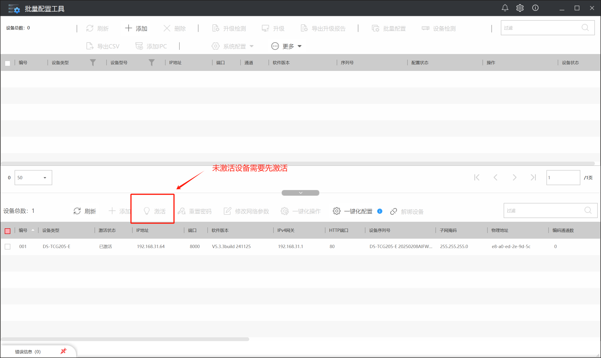

##### 4.进行网络参数配置，使摄像头IP地址与网关与路由器相配

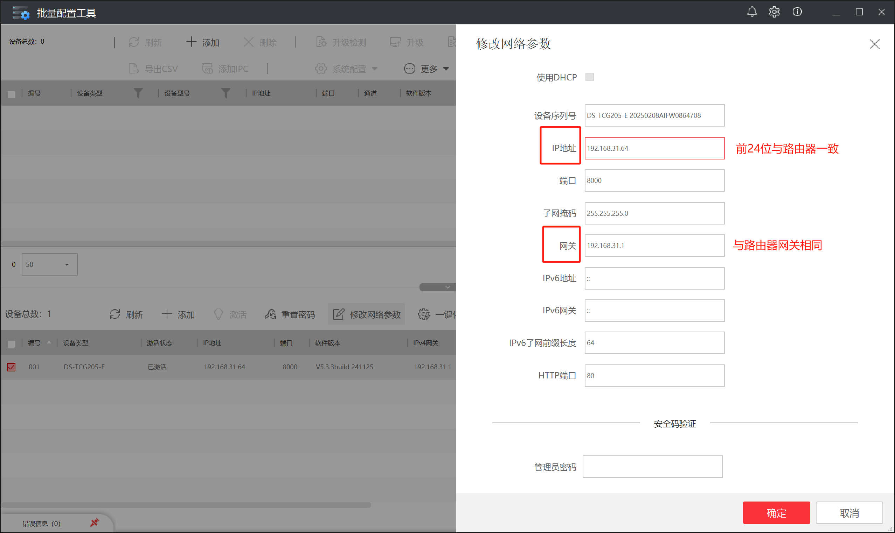

> 注意：HTTP端口(80)用于前端登录设备,端口(8000)用于后端登录设备

##### 5.浏览器打开摄像头IP地址，进行插件下载，安装前需要先关闭浏览器

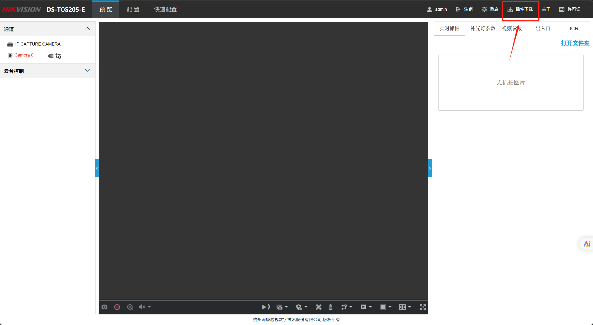

##### 6.安装完成后，重新在浏览器打开摄像头IP地址，进行相关设置

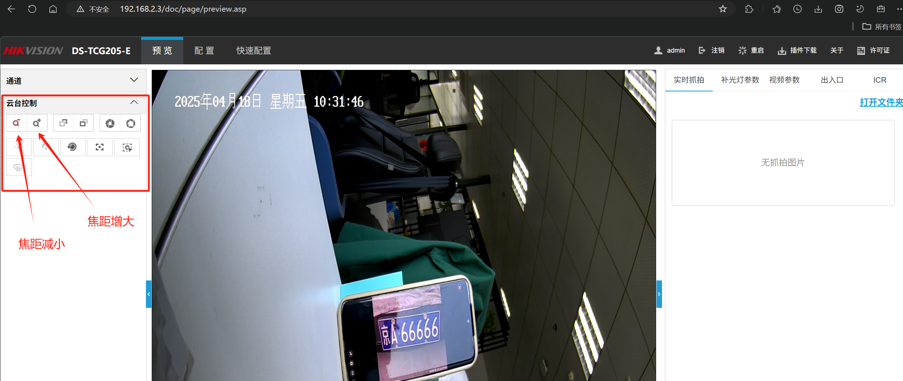

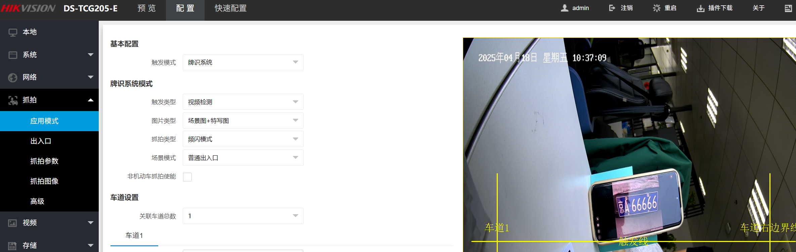

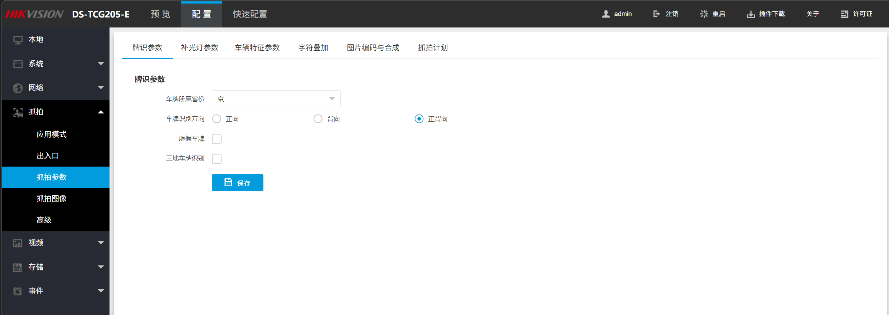

> 在调试过程中，没有修改默认配置，后续可以按需修改

##### 7.详细抓拍设置等见说明书

#### 前端Web集成

##### 1.下载[Web插件开发包](https://open.hikvision.com/download/5cda567cf47ae80dd41a54b3?type=10&id=4c945d18fa5f49638ce517ec32e24e24)

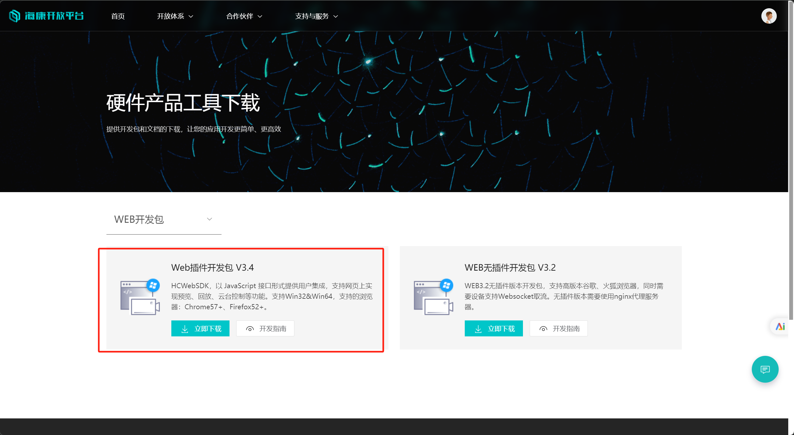

##### 2.解压后进入`WebSDK3.3.9_20241031151026\WebSDK3.3.9\webs\codebase`下，双击安装HCWebSDKPlugin


##### 3.进入目录`WebSDK3.3.9_20241031151026\WebSDK3.3.9\webs\cn`,打开demo.html

此时，输入摄像头IP地址，账号密码等并开启预览，应该可以正常看到画面

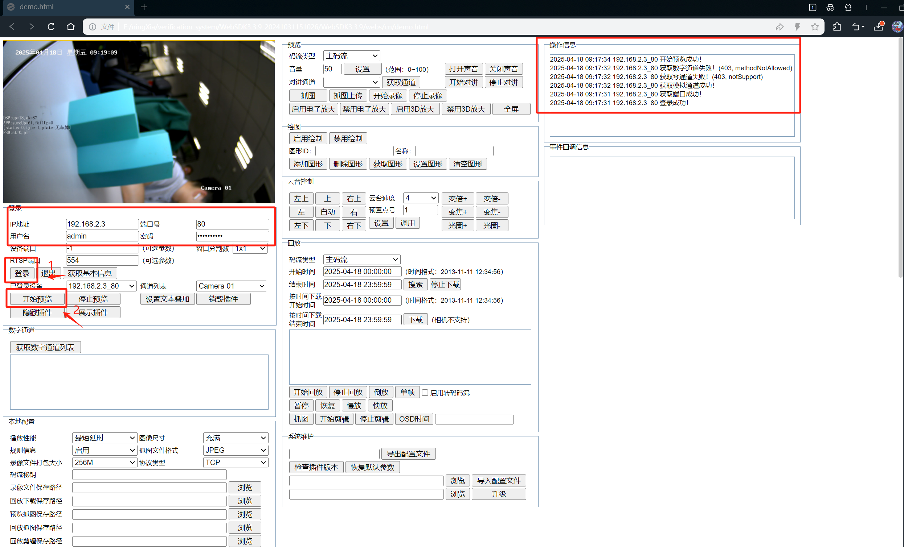

##### 4.将相关的css,js文件放到admin模块的`resources/static`目录下

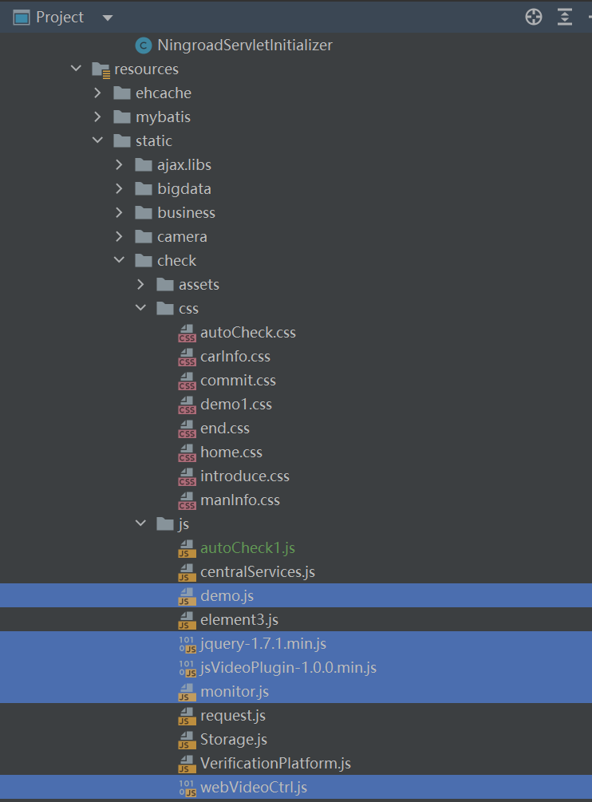

##### 5.在想要使用摄像头功能的页面 引入css，js文件

```html
<head>
    <title>在线监管</title>
    <link rel="stylesheet" th:href="@{/css/monitor.css}" />
</head>
<body>
    <div>
        <!--摄像头预览界面-->
        <div id="divPlugin" class="plugin"></div>
    </div>
    <script type="text/javascript" th:src="@{/js/jquery-1.7.1.min.js}"></script>
	<script type="text/javascript" th:src="@{/js/webVideoCtrl.js}"></script>
	<script type="text/javascript" th:src="@{/js/monitor.js}"></script>
</body>
```

> 原本放入摄像头这个div块即可在页面中打开摄像头页面，但是尝试发现如果**移除/隐藏其他demo.html中的内容，会导致摄像头预览界面失效**(可能其中某个模块有触发初始化的逻辑)

##### 6.在对应的js文件中，修改需要的逻辑

```js
cbInitPluginComplete: function () {
            WebVideoCtrl.I_InsertOBJECTPlugin("divPlugin").then(() => {
                // 检查插件版本后自动登录
                for (let i = 0; i < cameras.length; i++) {
                    autoLogin(cameras[i].ip, cameras[i].port, cameras[i].user, cameras[i].pwd, i);
                }
                // //登录后进行录制
                // setTimeout(() => {
                //     recordVideo(2000);//录制时长2s
                // },1000)
            });
        }
```

> 初始化完成后循环登录所有摄像头

```js
function autoLogin(szIP, szPort, szUsername, szPassword,index){
    //TODO 后面要确认摄像头信息从哪里获取
    // 使用配置自动登录
    var szDeviceIdentify = szIP + "_" + szPort;
    WebVideoCtrl.I_Login(
        szIP,
        1, // 端口类型
        szPort,
        szUsername,
        szPassword,
        {
            success: (xmlDoc) => {
                showOPInfo(szDeviceIdentify + " 登录成功！");
                // 获取通道信息
                getChannelInfo();
                getDevicePort();
                //开启预览，必须保证在通道信息获取后才开启预览
                setTimeout(() => {
                    startPreview(szDeviceIdentify,1,index);
                },100)

            },
            error: (oError) => {
                showOPInfo(szDeviceIdentify + " 登录失败！", oError.errorCode, oError.errorMsg);
                alert("自动连接监控失败，请手动登录！");
            }
        }
    );
}
```

> 自动登录，实现打开页面自动登录并开启预览

```js
function startPreview(deviceIdentify, channel, wndIndex) {
    WebVideoCtrl.I_StartRealPlay(deviceIdentify, {
        iWndIndex: wndIndex, // 指定窗口索引
        iStreamType: 1, // 主码流
        iChannelID: channel,
        bZeroChannel: false,
        success: () => {
            showOPInfo(`${deviceIdentify} 窗口${wndIndex}开始预览`);
        },
        error: (oError) => {
            showOPInfo(`${deviceIdentify} 预览失败`, oError.errorCode, oError.errorMsg);
        }
    });
}
```

> 启动多摄像头预览

```js
function recordVideo(duration=180000){
    startRecordingForAllWindows('realplay');
    setTimeout(function(){
        stopRecordingForAllWindows('realplay');
    }, duration); // 精确停止
}
```

> 录制视频

```js
const cameras = [
    { ip: '192.168.2.2', port: 80, user: 'admin', pwd: 'ningroad2025', channel: 1 },
    // { ip: '192.168.2.3', port: 80, user: 'admin', pwd: 'aq12345678', channel: 1 },
    // { ip: '192.168.2.4', port: 80, user: 'admin', pwd: 'pass3', channel: 1 },
    // { ip: '192.168.2.5', port: 80, user: 'admin', pwd: 'pass4', channel: 1 }
];
const g_recordHandles = new Map(); // 使用Map结构 key:窗口索引 value:句柄
function startRecordingForAllWindows() {
    // 清空旧句柄
    g_recordHandles.clear();

    // 遍历所有摄像头对应的窗口
    cameras.forEach((camera, wndIndex) => {
        const deviceId = `${camera.ip}_${camera.port}`;
        const filename = `${deviceId}_${new Date().getTime()}.mp4`;

        // 核心参数：指定窗口索引
        WebVideoCtrl.I_StartRecord(filename, {
            iWndIndex: wndIndex, // 关键参数！指定录像窗口
            iStreamType: 1,       // 主码流
            bAudio: true,         // 是否录制音频
            success: (handle) => {
                g_recordHandles.set(wndIndex, handle);
                showOPInfo(`窗口${wndIndex} 录像启动成功`);
            },
            error: (err) => {
                showOPInfo(`窗口${wndIndex} 录像失败`, err.errorCode, err.errorMsg);
            }
        });
    });
}

function stopRecordingForAllWindows() {
    g_recordHandles.forEach((handle, wndIndex) => {
        WebVideoCtrl.I_StopRecord({
            iHandle: handle,  // 使用保存的句柄
            iWndIndex: wndIndex, // 双重保障
            success: () => {
                showOPInfo(`窗口${wndIndex} 录像已停止`);
                g_recordHandles.delete(wndIndex);
            },
            error: (err) => {
                showOPInfo(`窗口${wndIndex} 停止失败`, err.errorCode, err.errorMsg);
            }
        });
    });
}
```

> 开始/结束所有摄像头的录制

*注意，初始化--登录--获取通道信息--开启预览--开始录像--结束录像，一系列操作必须**保证串行执行**，目前使用定时器来避免后面的流程先执行(一开始是为了简单，做的很笨，也许可以使用异步或者一些状态判断逻辑来实现)*

##### 7.修改录制文件保存路径

```js
// 设置本地参数
async function clickSetLocalCfg() {
    g_oLocalConfig.buffNumberType = $("#netsPreach").val();
    g_oLocalConfig.playWndType = $("#wndSize").val();
    g_oLocalConfig.ivsMode = $("#rulesInfo").val();
    g_oLocalConfig.captureFileFormat = $("#captureFileFormat").val();
    g_oLocalConfig.packgeSize = $("#packSize").val();
    g_oLocalConfig.recordPath = $("#recordPath").val();
    g_oLocalConfig.downloadPath = $("#downloadPath").val();
    g_oLocalConfig.capturePath = $("#previewPicPath").val();
    g_oLocalConfig.playbackPicPath = $("#playbackPicPath").val();
    g_oLocalConfig.deviceCapturePath = $("#devicePicPath").val();
    g_oLocalConfig.playbackFilePath = $("#playbackFilePath").val();
    g_oLocalConfig.protocolType = $("#protocolType").val();
    if ("\x7F\x7F\x7F\x7F\x7F\x7F\x7F\x7F" !== $("#secretKey").val()) {
        g_oLocalConfig.secretKey = await WebVideoCtrl.I_GetEncryptString($("#secretKey").val());
    }
    WebVideoCtrl.I_SetLocalCfg(g_oLocalConfig).then(() => {
        showOPInfo("本地配置设置成功！");
    }, (oError) => {
        var szInfo = "本地配置设置失败！";
        showOPInfo(szInfo, oError.errorCode, oError.errorMsg);
    });
}
```

> 此处原本是demo.html中保存文件路径的方法，可以参考此进行硬编码等配置文件上传路径

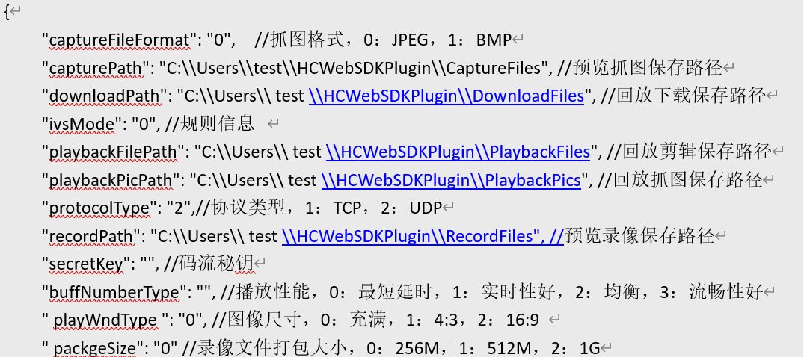

> 详细见HCWebSDK开发指南

#### 后端Web集成

##### 1.下载[设备网络SDK](https://open.hikvision.com/download/5cda567cf47ae80dd41a54b3?type=10&id=5cda5902f47ae80dd41a54b7)

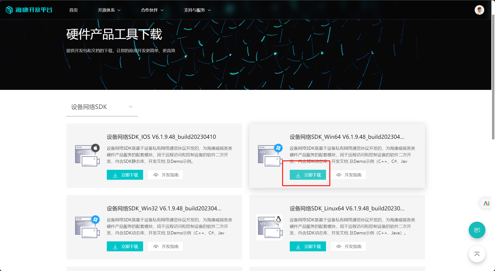

##### 2.安装插件

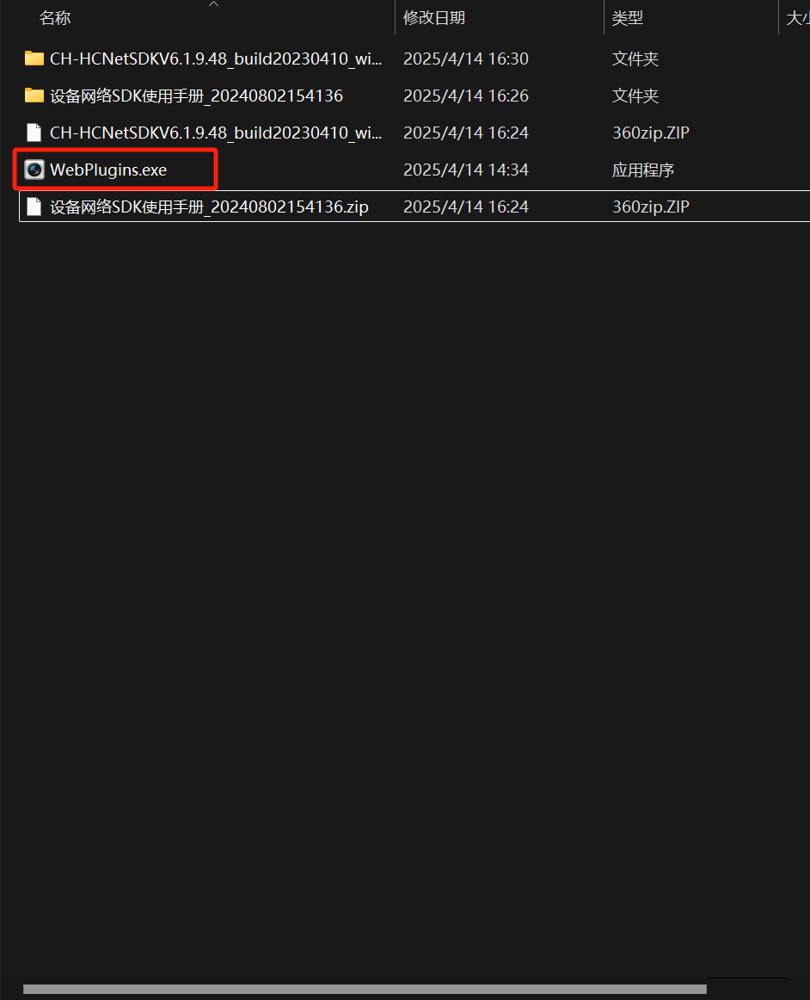

##### 3.将库文件中所有内容拷贝到/resources目录下

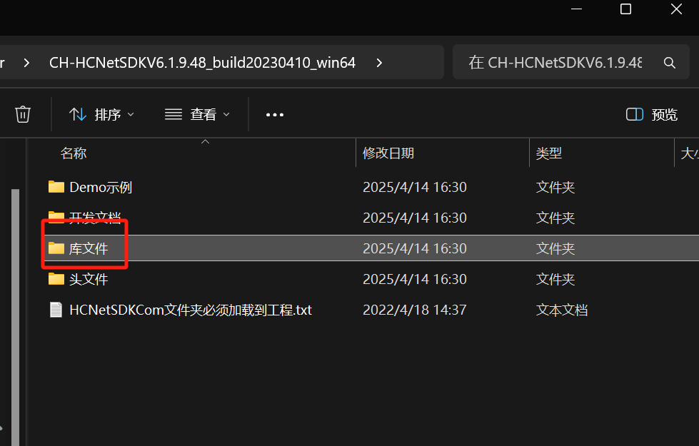

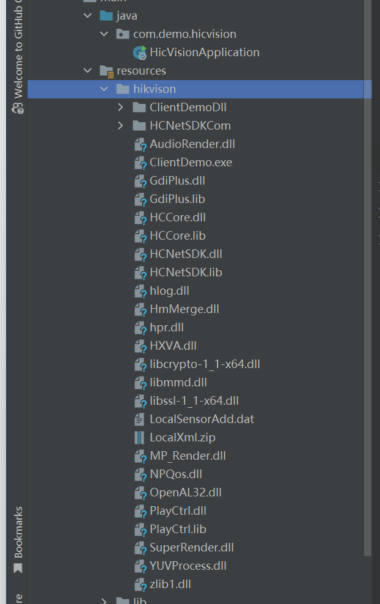

##### 4.在Demo示例中，找到Java示例，寻找lib文件夹和NetSDKDemo文件夹，放置到项目中

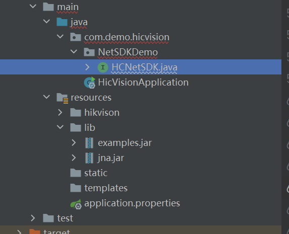

##### 5.将两个jar包添加到依赖中

```xml
		<dependency>
            <groupId>net.java.jna</groupId>
            <artifactId>jna</artifactId>
            <version>1.0.0</version>
            <scope>system</scope>
            <systemPath>${project.basedir}/src/main/resources/lib/jna.jar</systemPath>
        </dependency>
        <dependency>
            <groupId>net.java.examples</groupId>
            <artifactId>examples</artifactId>
            <version>1.0.0</version>
            <scope>system</scope>
         	 <systemPath>${project.basedir}/src/main/resources/lib/examples.jar</systemPath>
        </dependency>
```

##### 6.修改HCNetSDK中的.dll文件路径

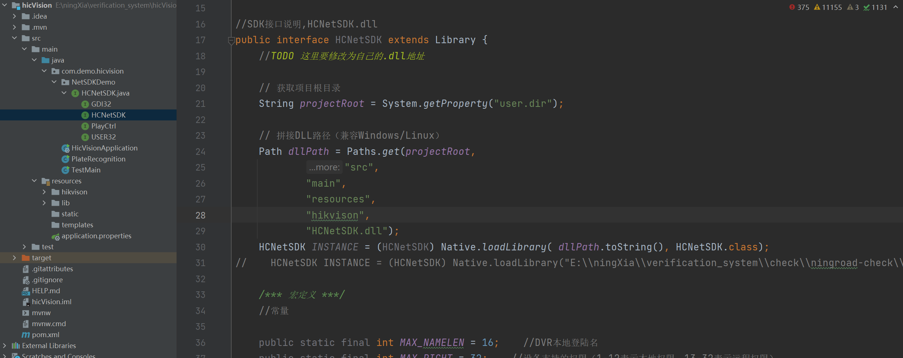

```java
 	// 获取项目根目录
    String projectRoot = System.getProperty("user.dir");

    // 拼接DLL路径（兼容Windows/Linux）
    Path dllPath = Paths.get(projectRoot,
            "src",
            "main",
            "resources",
            "hikvison",
            "HCNetSDK.dll");
    HCNetSDK INSTANCE = (HCNetSDK) Native.loadLibrary( dllPath.toString(), HCNetSDK.class);
//    HCNetSDK INSTANCE = (HCNetSDK) Native.loadLibrary("HCNetSDK.dll", HCNetSDK.class);

```

##### 7.车牌识别示例代码

```java
/**
 * 拍摄车牌号
 */
@Component
public class PlateRecognition {

    private static Logger logger = LoggerFactory.getLogger(PlateRecognition.class);

    private static int lUserID = -1;

    public String getPlateNo(String ipAddress,String account,String password,short port){
        String license= null;
        try {
            // 1. 初始化 SDK
            boolean initSuc = HCNetSDK.INSTANCE.NET_DVR_Init();
            license = "";
            if (!initSuc) {
                logger.error("SDK 初始化失败，错误码: " + HCNetSDK.INSTANCE.NET_DVR_GetLastError());
                return license;
            }
            logger.info("SDK 初始化成功");

            // 2. 登录设备
            HCNetSDK.NET_DVR_USER_LOGIN_INFO loginInfo = new HCNetSDK.NET_DVR_USER_LOGIN_INFO();
            loginInfo.bUseAsynLogin = 0;
            System.arraycopy(ipAddress.getBytes(), 0, loginInfo.sDeviceAddress, 0, ipAddress.length());
            System.arraycopy(account.getBytes(), 0, loginInfo.sUserName, 0, account.length());
            System.arraycopy(password.getBytes(), 0, loginInfo.sPassword, 0, password.length());
            loginInfo.wPort = port;

            HCNetSDK.NET_DVR_DEVICEINFO_V40 devInfo = new HCNetSDK.NET_DVR_DEVICEINFO_V40();
            lUserID = HCNetSDK.INSTANCE.NET_DVR_Login_V40(loginInfo, devInfo);
            if (lUserID < 0) {
                logger.error("登录失败，错误码: " + HCNetSDK.INSTANCE.NET_DVR_GetLastError());
                HCNetSDK.INSTANCE.NET_DVR_Cleanup();
                return license;
            }
            logger.info("设备登录成功");

            // 3. 设置回调函数
            PlateRecognitionCallback callback = new PlateRecognitionCallback();
            HCNetSDK.INSTANCE.NET_DVR_SetDVRMessageCallBack_V50(0, callback, null);

            // 4. 启动布防（开启事件检测）

            HCNetSDK.NET_DVR_SETUPALARM_PARAM alarmParam = new HCNetSDK.NET_DVR_SETUPALARM_PARAM();
            alarmParam.dwSize = alarmParam.size();
            int alarmHandle = HCNetSDK.INSTANCE.NET_DVR_SetupAlarmChan_V41(lUserID, alarmParam);
            if (alarmHandle < 0) {
                logger.error("布防失败，错误码: " + HCNetSDK.INSTANCE.NET_DVR_GetLastError());
            } else {
                logger.info("布防成功，开始抓拍...");

                // 手动抓拍（使用三参数接口）
                HCNetSDK.NET_DVR_MANUALSNAP snapCfg = new HCNetSDK.NET_DVR_MANUALSNAP();
                snapCfg.dwSize = snapCfg.size();
                snapCfg.bySnapTimes = 1;
                snapCfg.byTriggerMode = 1;
                snapCfg.byJointSnap = 0;

                HCNetSDK.NET_DVR_PLATE_RESULT plateResult = new HCNetSDK.NET_DVR_PLATE_RESULT();

                boolean triggered = HCNetSDK.INSTANCE.NET_DVR_ManualSnap(lUserID, snapCfg, plateResult);

                if (triggered) {
                    license = new String(plateResult.struPlateInfo.sLicense, Charset.forName("GBK")).trim();
                    logger.info("🚗 识别到车牌号：" + license);
                }
                else {
                    logger.error("❌ 手动抓拍失败，错误码: " + HCNetSDK.INSTANCE.NET_DVR_GetLastError());
                }
            }
        } catch (Exception e) {
            logger.error("❌ 识别到车牌号失败: " +e.getMessage());
        }

        // 5. 等待回调识别（可选）
        try {
            Thread.sleep(10000); // 等待识别结果回调（仅回调模式有效）
        } catch (InterruptedException e) {
            e.printStackTrace();
        }

        // 6. 清理资源
        HCNetSDK.INSTANCE.NET_DVR_Logout(lUserID);
        HCNetSDK.INSTANCE.NET_DVR_Cleanup();
        logger.info("已清理资源");
        return license;
    }

    public static void main(String[] args) {
//        getPlateNo("192.168.2.3","admin","aq12345678",(short)8000);
    }

    public static class PlateRecognitionCallback implements HCNetSDK.FMSGCallBack_V31 {
        @Override
        public void invoke(int lCommand, HCNetSDK.NET_DVR_ALARMER pAlarmer, Pointer pAlarmInfo, int dwBufLen, Pointer pUser) {
            logger.info("📥 接收到报警指令 lCommand = " + lCommand);
            if (lCommand == HCNetSDK.COMM_ITS_PLATE_RESULT) {
                HCNetSDK.NET_ITS_PLATE_RESULT result = new HCNetSDK.NET_ITS_PLATE_RESULT();
                result.write();
                result.getPointer().write(0, pAlarmInfo.getByteArray(0, result.size()), 0, result.size());
                result.read();

                String license = new String(result.struPlateInfo.sLicense).trim();
                logger.info("🚗 回调识别到车牌号：" + license);

                for (int i = 0; i < result.dwPicNum; i++) {
                    HCNetSDK.NET_ITS_PICTURE_INFO picInfo = result.struPicInfo[i];
                    if (picInfo.dwDataLen > 0) {
                        try (FileOutputStream fos = new FileOutputStream("plate_pic_" + System.currentTimeMillis() + ".jpg")) {
                            fos.write(picInfo.pBuffer.getByteArray(0, picInfo.dwDataLen));
                            logger.info("📸 图片保存成功");
                        } catch (IOException e) {
                            e.printStackTrace();
                        }
                    }
                }
            }
        }
    }
}
```

Main方法调用，可以正常识别

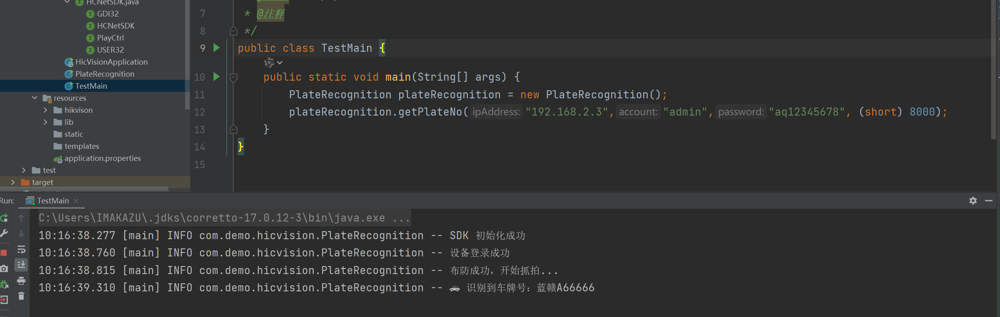

> 注意，jdk版本不低于17，否则可能加载不到主类